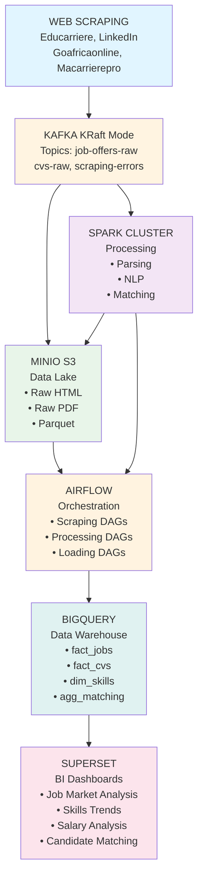

# 🏗️ Mise à Jour Architecture - Novembre 2024

## 📊 Changements Majeurs

### 1. ❌ Supprimé : Zookeeper
**Raison** : Kafka 3.3+ utilise KRaft (Kafka Raft Metadata Mode)  
**Avantage** : 
- Architecture simplifiée (-1 conteneur)
- Moins de ressources (~500 MB RAM économisée)
- Plus performant
- Futur de Kafka (Zookeeper déprécié en 2024)

### 2. ✅ Ajouté : MinIO (Data Lake)
**Remplace** : Google Cloud Storage (GCS)  
**Raison** : Développement 100% local  
**Avantages** :
- API S3-compatible (standard de l'industrie)
- Stockage illimité (limité par disque local)
- Console web intégrée
- 0€ de coût
- Compatible avec Spark (via S3A connector)

**Configuration** :
- Endpoint: http://localhost:9000 (API)
- Console: http://localhost:9001
- Credentials: minioadmin / minioadmin123

**Buckets créés automatiquement** :
- `datalake` : Données générales
- `raw-data` : Données brutes non traitées
- `processed-data` : Données traitées par Spark
- `scraped-jobs` : Offres d'emploi scrapées (HTML/JSON)
- `scraped-cvs` : CVs scrapés (PDF/DOCX/JSON)
- `backups` : Sauvegardes

### 3. ✅ Ajouté : Apache Superset (BI)
**Remplace** : Google Looker Studio  
**Raison** : Solution BI 100% open-source et locale  
**Avantages** :
- Dashboards interactifs puissants
- SQL Lab intégré (IDE SQL)
- Nombreux connecteurs (BigQuery, PostgreSQL, etc.)
- Customisable et extensible
- Gratuit et open-source

**Configuration** :
- URL: http://localhost:8088
- Login: admin / admin
- Base de données : PostgreSQL (partagée avec Airflow)

### 4. ✅ Ajouté : Couche de Scraping
**Nouveau composant** : Container dédié au web scraping  
**Technologies** :
- Scrapy : Framework de scraping
- Selenium : Browser automation
- Playwright : Alternative moderne à Selenium
- BeautifulSoup : Parsing HTML
- spaCy : NLP pour extraction
- pdfplumber : Parsing de CVs PDF

**Topics Kafka créés** :
- `job-offers-raw` : Offres brutes HTML
- `job-offers-parsed` : Offres parsées JSON
- `cvs-raw` : CVs bruts (PDF/DOCX)
- `cvs-parsed` : CVs parsés JSON
- `scraping-errors` : Erreurs de scraping
- `scraper-commands` : Commandes pour les scrapers
- `scraper-status` : Statut des scrapers

### 5. ✅ Ajouté : Redis
**Raison** : Cache pour Airflow et Superset  
**Avantages** :
- Améliore les performances
- Réduit la charge sur PostgreSQL
- Standard pour Superset

### 6. 🔄 Modifié : PostgreSQL
**Changement** : Supporte maintenant 2 bases de données  
- `airflow` : Métadonnées Airflow
- `superset` : Métadonnées Superset

Script d'init : `docker/postgres/init-multiple-databases.sh`

## 🔗 Nouvelle Architecture de Données

```
┌─────────────────────────────────────────────────────────┐
│                   WEB SCRAPING                          │
│ (Educarriere, LinkedIn, Goafricaonline, Macarrierepro)  │
└──────────────────────┬──────────────────────────────────┘
                       │
                       ▼
┌─────────────────────────────────────────────────────────┐
│                KAFKA (KRaft Mode)                       │
│  Topics: job-offers-raw, cvs-raw, scraping-errors       │
└──────────────────────┬──────────────────────────────────┘
                       │
         ┌─────────────┴─────────────┐
         │                           │
         ▼                           ▼
┌─────────────────┐         ┌──────────────────┐
│   MINIO (S3)    │         │  SPARK CLUSTER   │
│   Data Lake     │◄────────│  Processing      │
│   • Raw HTML    │         │  • Parsing       │
│   • Raw PDF     │         │  • NLP           │
│   • Parquet     │         │  • Matching      │
└─────────────────┘         └──────────────────┘
         │                           │
         │                           │
         └─────────────┬─────────────┘
                       │
                       ▼
         ┌─────────────────────────┐
         │    AIRFLOW              │
         │    Orchestration        │
         │    • Scraping DAGs      │
         │    • Processing DAGs    │
         │    • Loading DAGs       │
         └──────────┬──────────────┘
                    │
                    ▼
         ┌─────────────────────────┐
         │    BIGQUERY             │
         │    Data Warehouse       │
         │    • fact_jobs          │
         │    • fact_cvs           │
         │    • dim_skills         │
         │    • agg_matching       │
         └──────────┬──────────────┘
                    │
                    ▼
         ┌─────────────────────────┐
         │    SUPERSET             │
         │    BI Dashboards        │
         │    • Job Market Analysis│
         │    • Skills Trends      │
         │    • Salary Analysis    │
         │    • Candidate Matching │
         └─────────────────────────┘
```

### 📊 Diagramme Mermaid



## 📦 Services Docker

### Services Principaux (11 conteneurs)

1. **kafka** : Broker Kafka (KRaft mode)
2. **schema-registry** : Validation schémas Avro
3. **kafka-ui** : Interface web Kafka
4. **minio** : Data Lake S3-compatible
5. **minio-init** : Initialisation buckets (one-shot)
6. **spark-master** : Spark cluster manager
7. **spark-worker-1** : Worker node 1
8. **spark-worker-2** : Worker node 2
9. **postgres** : BDD (Airflow + Superset)
10. **redis** : Cache (Airflow + Superset)
11. **airflow-webserver** : Interface Airflow
12. **airflow-scheduler** : Ordonnanceur Airflow
13. **airflow-init** : Initialisation Airflow (one-shot)
14. **superset** : Interface Superset
15. **superset-init** : Initialisation Superset (one-shot)
16. **scrapers** : Container de scraping
17. **jupyter** : Notebooks PySpark

**Total** : 17 conteneurs (dont 2 one-shot)  
**Actifs en permanence** : 15 conteneurs

## 🔌 Ports Utilisés

| Service | Port | Usage |
|---------|------|-------|
| Kafka | 9092 | Kafka broker (externe) |
| Kafka | 29092 | Kafka broker (interne) |
| Schema Registry | 8081 | API REST schémas |
| Kafka UI | 8080 | Interface web |
| MinIO API | 9000 | API S3 |
| MinIO Console | 9001 | Interface web |
| Spark Master | 7077 | Spark cluster |
| Spark Master UI | 8082 | Interface web |
| Spark Worker 1 | 8083 | Interface web |
| Spark Worker 2 | 8084 | Interface web |
| PostgreSQL | 5432 | Base de données |
| Redis | 6379 | Cache |
| Airflow | 8085 | Interface web |
| Superset | 8088 | Interface web |
| Jupyter | 8888 | JupyterLab |
| Spark Job UI | 4040 | Spark application UI |

## 💾 Volumes Persistants

```yaml
volumes:
  kafka_data:           # Messages Kafka
  minio_data:           # Fichiers MinIO (Data Lake)
  spark_master_data:    # Données Spark Master
  spark_worker_1_data:  # Données Spark Worker 1
  spark_worker_2_data:  # Données Spark Worker 2
  postgres_data:        # Bases de données PostgreSQL
  redis_data:           # Cache Redis
  superset_home:        # Configuration Superset
```

## 🔧 Configuration Spark + MinIO

Spark est configuré pour accéder à MinIO via le protocole S3A :

```python
spark = SparkSession.builder \
    .appName("MyApp") \
    .config("spark.hadoop.fs.s3a.endpoint", "http://minio:9000") \
    .config("spark.hadoop.fs.s3a.access.key", "minioadmin") \
    .config("spark.hadoop.fs.s3a.secret.key", "minioadmin123") \
    .config("spark.hadoop.fs.s3a.path.style.access", "true") \
    .config("spark.hadoop.fs.s3a.impl", "org.apache.hadoop.fs.s3a.S3AFileSystem") \
    .getOrCreate()

# Lire depuis MinIO
df = spark.read.parquet("s3a://datalake/data/jobs.parquet")

# Écrire dans MinIO
df.write.mode("overwrite").parquet("s3a://processed-data/output/")
```

## 🚀 Workflow Complet

### 1. Scraping
```
Scraper Daemon (Python)
  → Scrape sites web (Indeed, LinkedIn, etc.)
  → Produit messages Kafka (job-offers-raw, cvs-raw)
  → Sauvegarde HTML/PDF dans MinIO (scraped-jobs, scraped-cvs)
```

### 2. Processing (Spark Streaming)
```
Spark Streaming
  → Consomme topics Kafka (job-offers-raw, cvs-raw)
  → Parse HTML/PDF
  → Extraction NLP (compétences, salaires, localisations)
  → Déduplication
  → Sauvegarde Parquet dans MinIO (processed-data)
  → Produit topics Kafka (job-offers-parsed, cvs-parsed)
```

### 3. Loading (Airflow + Spark Batch)
```
Airflow DAG (quotidien)
  → Lance Spark Batch Job
  → Lit données MinIO (processed-data)
  → Agrégations et transformations
  → Chargement dans BigQuery
  → Notification fin de traitement
```

### 4. Analytics (Superset)
```
Superset
  → Se connecte à BigQuery
  → Dashboards interactifs
  → Requêtes SQL Lab
  → Exports et rapports
```

## 📊 Schéma BigQuery

### Tables Dimension (dim_*)

```sql
-- dim_skills : Compétences
CREATE TABLE dim_skills (
  skill_id STRING,
  skill_name STRING,
  skill_category STRING,
  created_at TIMESTAMP
);

-- dim_companies : Entreprises
CREATE TABLE dim_companies (
  company_id STRING,
  company_name STRING,
  industry STRING,
  location STRING
);

-- dim_locations : Localisations
CREATE TABLE dim_locations (
  location_id STRING,
  city STRING,
  region STRING,
  country STRING
);
```

### Tables de Fait (fact_*)

```sql
-- fact_job_offers : Offres d'emploi
CREATE TABLE fact_job_offers (
  job_id STRING,
  title STRING,
  company_id STRING,
  location_id STRING,
  salary_min FLOAT64,
  salary_max FLOAT64,
  contract_type STRING,
  remote_option BOOLEAN,
  skills ARRAY<STRING>,
  posted_date DATE,
  scraped_at TIMESTAMP
)
PARTITION BY posted_date
CLUSTER BY company_id, location_id;

-- fact_candidates : Candidats/CVs
CREATE TABLE fact_candidates (
  candidate_id STRING,
  skills ARRAY<STRING>,
  years_experience INT64,
  education_level STRING,
  desired_salary FLOAT64,
  location_id STRING,
  scraped_at TIMESTAMP
)
PARTITION BY DATE(scraped_at);
```

### Tables Agrégées (agg_*)

```sql
-- agg_matching_scores : Scores de matching
CREATE TABLE agg_matching_scores (
  job_id STRING,
  candidate_id STRING,
  match_score FLOAT64,
  skill_match_pct FLOAT64,
  salary_match_pct FLOAT64,
  location_match_pct FLOAT64,
  calculated_at TIMESTAMP
)
PARTITION BY DATE(calculated_at)
CLUSTER BY job_id, candidate_id;
```

## 🎯 Prochaines Étapes

1. **Implémenter les scrapers** (Indeed, LinkedIn, WTTJ, Apec)
2. **Créer les jobs Spark** (parsing, NLP, matching)
3. **Créer les DAGs Airflow** (orchestration)
4. **Créer les dashboards Superset** (visualisation)
5. **Configurer BigQuery** (schéma et connexion)

## 📚 Ressources Utiles

- [Kafka KRaft Documentation](https://kafka.apache.org/documentation/#kraft)
- [MinIO Documentation](https://min.io/docs/minio/linux/index.html)
- [Apache Superset Documentation](https://superset.apache.org/docs/intro)
- [Scrapy Documentation](https://docs.scrapy.org/)
- [Spark S3A Documentation](https://hadoop.apache.org/docs/stable/hadoop-aws/tools/hadoop-aws/index.html)

---

**Architecture mise à jour le : 24 novembre 2024**

